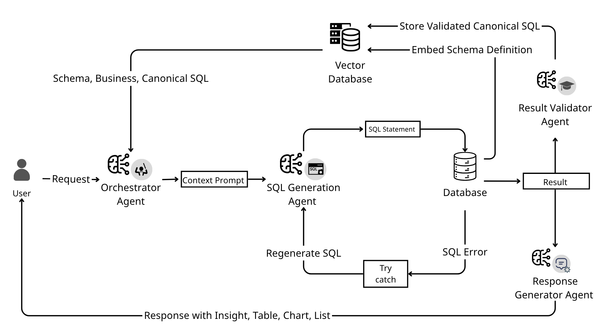
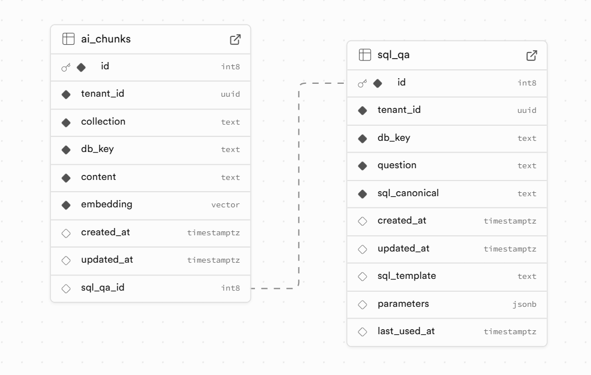
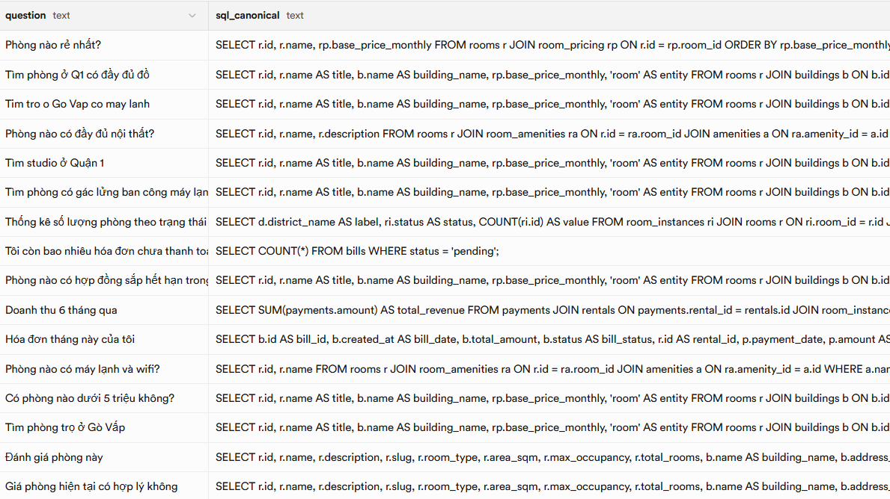

# Trustay-AI

### From Zero to Golden

**A self-validating multi-agent framework for solving the Text-to-SQL cold start**

<p>
  
  &nbsp;&nbsp;
  
  &nbsp;&nbsp;
  
  &nbsp;&nbsp;
  
  &nbsp;&nbsp;
  
  &nbsp;&nbsp;
  
</p>

<p>
  <strong><a href="docs/Trustay-AI.pdf">Read the paper</a></strong>
  &nbsp;&nbsp;·&nbsp;&nbsp;
  <strong><a href="#system-architecture">Architecture</a></strong>
  &nbsp;&nbsp;·&nbsp;&nbsp;
  <strong><a href="#reported-evaluation">Evaluation</a></strong>
  &nbsp;&nbsp;·&nbsp;&nbsp;
  <strong><a href="#quick-start">Quick start</a></strong>
</p>

---

## What is Trustay-AI?

Trustay-AI is a production-oriented rental platform backend and an applied AI research system for **domain-aware Text-to-SQL**. Its central question is practical:

> How can an enterprise deploy useful Text-to-SQL with no application-specific labeled dataset—and use operation itself to create that dataset?

The system coordinates specialized agents to understand a request, retrieve only the relevant schema and business knowledge, generate a read-only SQL query, recover from execution errors, validate the answer against the user's intent, and present the result as a list, table, chart, or insight. Validated question–SQL pairs become **canonical SQL**: reusable examples and a growing data asset for future model improvement.

This repository applies that architecture to **Trustay**, a Vietnamese rental-management domain covering rooms, buildings, bookings, contracts, billing, roommate matching, search, chat, payments, and real-time events.

## The cold-start paradox

Supervised Text-to-SQL normally begins with expensive “golden” question–SQL pairs that must be rebuilt for every schema. A static-prompt system can operate without training data, but its mistakes and successes do not accumulate durable value.

Trustay-AI addresses the paradox described in the paper:

> **Without data, the system cannot operate; without operation, there is no data.**

Its answer is a compounding knowledge loop:

\
Trustay-AI processing flow: RAG grounding, SQL self-repair, result validation, response generation, and canonical knowledge harvesting.

### Zero → Golden, step by step

1. **Zero-shot start** — begin with an LLM, database metadata, and business rules; no application-specific fine-tuning set is required.
2. **Context grounding** — RAG retrieves relevant `schema`, `business`, `docs`, and previously validated `qa` chunks instead of placing the entire schema in every prompt.
3. **Generate–execute–repair** — the SQL agent produces read-only queries and uses database errors as feedback for regeneration.
4. **Self-validation** — the validator compares the original question, canonicalized intent, generated SQL, expected response type, and result preview.
5. **Knowledge harvesting** — accepted interactions are parameterized and stored as canonical SQL, enabling retrieval, reuse, and future fine-tuning.

The paper describes automatic persistence after validation. The current implementation adds a **human-in-the-loop promotion gate**: validated candidates enter `PendingKnowledge`, and an administrator approves them before they reach the canonical vector repository. This makes the codebase more conservative than the research prototype while preserving the same compounding-learning mechanism.

## Research contribution

Trustay-AI combines four ideas into one operational loop:

| Contribution | Mechanism | Practical effect |
| --- | --- | --- |
| Specialized multi-agent reasoning | Orchestrator, SQL Generation, Response Generator, Result Validator | Separates intent, generation, presentation, and verification concerns |
| Context-efficient RAG | Cosine-similarity retrieval over tenant-scoped pgvector collections | Reduces irrelevant schema context and improves domain grounding |
| Canonical SQL reuse | Exact-first retrieval plus semantic matching of validated Q&A | Reuses proven patterns for similar questions and lowers repeated-generation latency |
| Self-correction and harvesting | Safe execution, error feedback, logical validation, approval workflow | Converts successful interactions into traceable reusable knowledge |

Schema ingestion uses a `table_complete` strategy: each table is represented as one coherent JSON knowledge unit containing its business meaning, constraints, columns, relationships, sample values, and representative queries. This limits context fragmentation during retrieval.

## Reported evaluation

The accompanying November 2025 paper compares a static-prompt Gemini 2.0 Flash baseline with Trustay-AI using the same model backbone. Execution accuracy (EX) is evaluated on practical rental-management queries grouped by challenge type.

| Challenge group | Weight | Static prompt | Trustay-AI |
| --- | --- | --- | --- |
| Simple queries with implicit context | 7 | 4/7 (57%) | **7/7 (100%)** |
| Business logic and complex JOIN chains | 8 | 2/8 (25%) | **4/8 (50%)** |
| Ambiguity and domain semantics (RAG) | 10 | 4/10 (40%) | **10/10 (100%)** |
| Robustness to synonyms and typos | 5 | 3.75/5 (75%) | **5/5 (100%)** |
| **Overall execution accuracy** | **30** | **13.75/30 (45.8%)** | **24/30 (80.0%)** |

That is a **+34.2 percentage-point absolute improvement** and a reported **63% reduction in failed queries** relative to the baseline. In three repeated-query scenarios, canonical reuse reduced end-to-end latency by **16.7%–33.4%**; the experiment did not observe a meaningful reduction in token consumption.

> These are the results reported in `docs/Trustay-AI.pdf`, using best-of-N runs and manual comparison with business ground truth. They are evidence from the paper's domain-specific evaluation—not a claim of universal Text-to-SQL performance.

## System architecture

### Agent responsibilities

| Agent | Responsibility | Key output |
| --- | --- | --- |
| **Orchestrator** | Resolves user intent, page context, role, entities, filters, and missing parameters | Structured execution plan and context hints |
| **Question Expansion** | Converts short follow-ups into standalone canonical questions | Context-complete natural-language query |
| **SQL Generation** | Retrieves focused schema/Q&A context, chooses reuse or generation, enforces read-only execution, and self-corrects | SQL statement and serialized rows |
| **Response Generator** | Chooses and builds user-facing `LIST`, `TABLE`, `CHART`, or `INSIGHT` payloads | Structured response plus natural-language explanation |
| **Result Validator** | Checks semantic alignment, safety signals, result plausibility, severity, and violations | `IS_VALID`, reason, evaluation, and violations |

The response generator and validator run concurrently after successful SQL execution. This keeps presentation latency low while the knowledge candidate is evaluated in the background path.

### Vector knowledge model

\
Figure from the paper: tenant-aware vector chunks linked to canonical question–SQL records.

```text
Supabase PostgreSQL + pgvector
├── ai_chunks
│   ├── schema    table_complete schema representations
│   ├── business  domain rules and reference knowledge
│   ├── docs      denormalized supporting documentation
│   └── qa        embedded, reusable question–SQL examples
└── sql_qa
    ├── question
    ├── sql_canonical
    ├── sql_template
    └── parameters
```

Embeddings use Google `text-embedding-004` at 768 dimensions. Retrieval is isolated by `tenant_id`, collection, and database key, with cosine similarity implemented by pgvector.

### The harvested asset

\
Examples collected during the paper's experiment: natural-language questions paired with validated canonical SQL.

The repository is more than a cache. It is a domain-specific, auditable dataset that can serve as high-quality few-shot context today and supervised fine-tuning material later.

## Beyond the research prototype

Trustay Core is not only an AI demonstration. The NestJS application also includes:

- JWT authentication, optional anonymous AI sessions, validation, rate limiting, security headers, and structured logging
- Rental inventory, buildings, rooms, bookings, invitations, contracts, billing, payments, ratings, and roommate workflows
- PostgreSQL via Prisma, Redis-backed caching and queues, Elasticsearch search, and Socket.IO real-time events
- PDF contract generation, file/image processing, Swagger/OpenAPI documentation, and health checks
- AI processing logs, persistent conversation history, pending-knowledge review, and tenant-aware vector retrieval

## Technology stack

| Layer | Technology |
| --- | --- |
| API | NestJS 11, TypeScript 5.7, Express, Swagger/OpenAPI |
| Primary data | PostgreSQL 17, Prisma 6 |
| AI | Google Gemini 2.0 Flash, Vercel AI SDK |
| Retrieval | Supabase PostgreSQL, pgvector, `text-embedding-004` |
| Search and state | Elasticsearch 8, Redis 7, Bull/BullMQ |
| Realtime and media | Socket.IO, Sharp, Puppeteer |
| Quality | Jest, Supertest, Biome, ESLint, Lefthook |
| Delivery | Docker multi-stage build, Docker Compose |

## Quick start

### Prerequisites

- Node.js 22+
- pnpm
- Docker with Compose
- A Google Generative AI API key
- A Supabase project with pgvector for the RAG path

### 1. Install and configure

```bash
git clone https://github.com/thanhcanhit/trustay-core.git
cd trustay-core
pnpm install
cp env.example .env
```

Complete `.env` before startup. The application validates `DATABASE_URL`, a 32+ character `JWT_SECRET`, `RESEND_API_KEY`, and the PayOS credentials/URLs. AI and RAG additionally require `GOOGLE_GENERATIVE_AI_API_KEY` and the `SUPABASE_*` values. When using Docker Compose, also define `POSTGRES_USER`, `POSTGRES_PASSWORD`, `POSTGRES_DB`, and `POSTGRES_INITDB_ARGS`.

### 2. Start infrastructure and prepare data

```bash
docker compose up -d trustay-postgres trustay-redis trustay-elasticsearch
pnpm exec prisma generate
pnpm exec prisma migrate dev
```

For semantic retrieval, apply the SQL files in `src/ai/vector-store/migrations` to the Supabase database, then ingest embeddings:

```bash
pnpm ai:build-embeddings
```

Optional reference/sample data flows are documented in `scripts/README.md`.

### 3. Run the API

```bash
pnpm dev
```

| Service | URL |
| --- | --- |
| API | `http://localhost:3000/api` |
| Swagger UI | `http://localhost:3000/api/docs` |
| Health check | `http://localhost:3000/health` |
| PostgreSQL | `localhost:1206` |
| Elasticsearch | `http://localhost:9200` |
| pgweb | `http://localhost:8081` |

### 4. Ask a domain question

Authentication is optional for the chat endpoint; authenticated requests receive user-aware filtering.

```bash
curl -X POST http://localhost:3000/api/ai/chat \
  -H 'Content-Type: application/json' \
  -d '{
    "query": "Liệt kê các hợp đồng sắp hết hạn trong 30 ngày tới",
    "currentPage": "/dashboard/contracts"
  }'
```

## Development commands

| Command | Purpose |
| --- | --- |
| `pnpm dev` | Start NestJS in watch mode |
| `pnpm build` | Build the production application |
| `pnpm test` | Run unit tests |
| `pnpm test:e2e` | Run end-to-end tests |
| `pnpm test:cov` | Generate Jest coverage |
| `pnpm check` | Run Biome checks |
| `pnpm db:setup-sample` | Load the sample data sequence |
| `pnpm es:seed` | Seed Elasticsearch indexes |
| `pnpm ai:build-embeddings` | Build schema embeddings for RAG |

## Project map

```text
trustay-core/
├── docs/                         paper, slides, and architecture assets
├── prisma/                       domain schema and migrations
├── scripts/                      data import, indexing, and setup automation
└── src/
    ├── ai/
    │   ├── agents/               orchestrate → generate → respond → validate
    │   ├── knowledge/            ingestion and canonical knowledge lifecycle
    │   ├── prompts/              domain-aware agent contracts
    │   ├── vector-store/         Supabase/pgvector adapter and SQL migrations
    │   └── services/             conversations, audit logs, HITL approval
    ├── api/                      rental-domain modules
    ├── auth/                     JWT authentication and authorization
    ├── cache/                    Redis caching, status, and rate controls
    ├── elasticsearch/            indexed search and synchronization
    ├── queue/                    background processors
    └── realtime/                 Socket.IO gateway
```

## Research status & limitations

Trustay-AI is an active research prototype embedded in a real application. The paper identifies two important remaining failure modes:

- **Complex Boolean semantics** — list-style “AND” requirements can be incorrectly translated into `IN`/“OR” behavior.
- **Security inside subqueries** — ownership filters may be present in the outer query but omitted from a nested subquery.

The current validator is stronger at syntax and execution feedback than at proving business logic or row-level security. Production deployments should retain least-privilege database credentials, statement allowlists, tenant isolation, query limits, audit logs, and human review for promoted knowledge. Do not treat LLM validation as a formal correctness proof.

## Paper & citation

**From Zero to Golden: A Self-Validating Multi-Agent Framework to Solve the Text-to-SQL Cold Start**\
Nguyen Thanh Canh, Ho Thi Nhu Tam, and Tran Thi Anh Thi — Industrial University of Ho Chi Minh City, November 2025.

```bibtex
@article{nguyen2025trustayai,
  title   = {From Zero to Golden: A Self-Validating Multi-Agent Framework
             to Solve the Text-to-SQL Cold Start},
  author  = {Nguyen, Thanh Canh and Ho, Thi Nhu Tam and Tran, Thi Anh Thi},
  year    = {2025},
  month   = nov,
  note    = {Research paper, Industrial University of Ho Chi Minh City}
}
```

The manuscript is available at `docs/Trustay-AI.pdf`; presentation slides are available at `docs/Slide.pdf`.

## Acknowledgements

This project was developed at the Faculty of Information Technology, Industrial University of Ho Chi Minh City. It explores a pragmatic path from zero domain labels to a governed canonical SQL repository: **operate, validate, harvest, and improve**.

---

Built as an applied research system—not just a prompt around a model.
