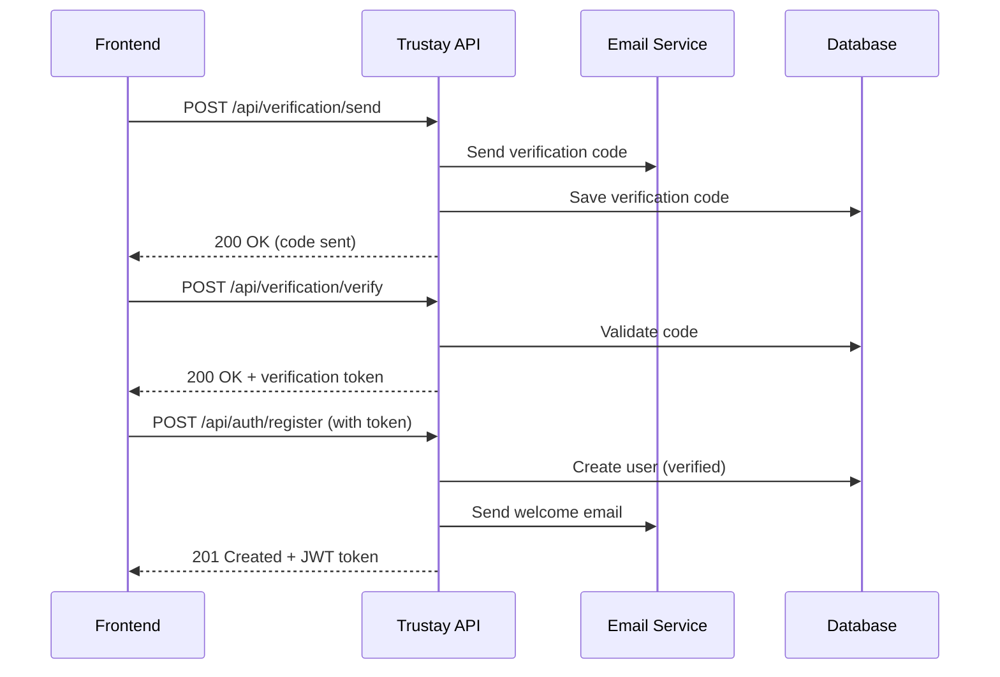
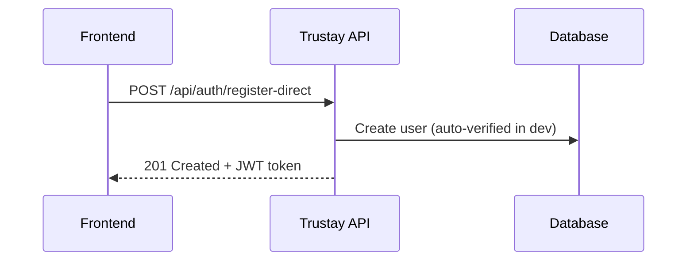

# 📝 Trustay Registration Guide

Hướng dẫn đăng ký người dùng với 2 phương thức: **Verification Flow** (Production) và **Direct Registration** (Development).

## 🔄 Registration Flow Options

### 1. 🛡️ **Verification Flow (Recommended - Production)**

Flow này yêu cầu xác thực email/phone trước khi đăng ký:

> **📱 Lưu ý:** SMS verification tạm thời bị tắt. Hiện tại chỉ hỗ trợ email verification.



### 2. ⚡ **Direct Registration (Development Only)**

Flow này bỏ qua verification cho development:



---

## 🚀 API Endpoints

### **Step 1: Send Verification Code**

**Email verification (Available):**
```http
POST /api/verification/send
Content-Type: application/json

{
  "type": "email",
  "email": "user@trustay.life"
}
```

**Phone verification (Temporarily Disabled):**
```http
POST /api/verification/send
Content-Type: application/json

{
  "type": "phone",
  "phone": "+84901234567"
}
```

**Response (Email):**
```json
{
  "message": "Verification code sent to email successfully",
  "verificationId": "clx123456789",
  "expiresInMinutes": 5,
  "remainingAttempts": 5
}
```

**Response (Phone - SMS Disabled):**
```json
{
  "message": "SMS verification is temporarily disabled. Please use email verification instead.",
  "verificationId": "clx123456789",
  "expiresInMinutes": 5,
  "remainingAttempts": 5,
  "smsDisabled": true
}
```

### **Step 2: Verify Code**

```http
POST /api/verification/verify
Content-Type: application/json

{
  "type": "email",
  "email": "user@trustay.life",
  "code": "123456"
}
```

**Response:**
```json
{
  "message": "Email verified successfully",
  "canProceedToRegister": true,
  "verificationToken": "eyJhbGciOiJIUzI1NiIsInR5cCI6IkpXVCJ9..."
}
```

### **Step 3: Complete Registration**

```http
POST /api/auth/register
Content-Type: application/json
X-Verification-Token: eyJhbGciOiJIUzI1NiIsInR5cCI6IkpXVCJ9...

{
  "email": "user@trustay.life",
  "password": "SecurePassword123!",
  "firstName": "Minh",
  "lastName": "Nguyễn",
  "phone": "+84901234567",
  "gender": "male",
  "role": "tenant"
}
```

**Response:**
```json
{
  "access_token": "eyJhbGciOiJIUzI1NiIsInR5cCI6IkpXVCJ9...",
  "user": {
    "id": "clx123456789",
    "email": "user@trustay.life",
    "firstName": "Minh",
    "lastName": "Nguyễn",
    "role": "tenant",
    "isVerifiedEmail": true,
    "isVerifiedPhone": false
  },
  "token_type": "Bearer",
  "expires_in": 3600
}
```

---

## 🛠️ Development Mode

### **Direct Registration (No Verification)**

```http
POST /api/auth/register-direct
Content-Type: application/json

{
  "email": "dev@trustay.life",
  "password": "DevPassword123!",
  "firstName": "Dev",
  "lastName": "User",
  "role": "landlord"
}
```

**Response:** Same as regular registration

---

## ⚙️ Environment Configuration

```env
# Development mode allows direct registration
NODE_ENV="development"
ALLOW_DIRECT_REGISTRATION=true

# Production mode enforces verification
NODE_ENV="production"
ALLOW_DIRECT_REGISTRATION=false

# Email service
RESEND_API_KEY="re_your_api_key"

# JWT
JWT_SECRET="your-secret-key"
JWT_EXPIRES_IN="1h"
```

---

## 🚨 Error Handling

### **Missing Verification Token**

```http
POST /api/auth/register
# (without X-Verification-Token header)
```

**Error Response:**
```json
{
  "statusCode": 400,
  "message": "Verification token is required",
  "error": "VERIFICATION_TOKEN_MISSING",
  "details": {
    "step": "verification_required",
    "instructions": [
      "1. Call POST /api/verification/send to send verification code",
      "2. Call POST /api/verification/verify to verify code and get token",
      "3. Include token in X-Verification-Token header for registration"
    ],
    "alternativeEndpoint": {
      "development": "POST /api/auth/register-direct (development only)",
      "description": "Use register-direct for development without verification"
    }
  }
}
```

### **Production Direct Registration Block**

```http
POST /api/auth/register-direct
# (in production environment)
```

**Error Response:**
```json
{
  "statusCode": 400,
  "message": "Direct registration is not allowed in production. Please use email/phone verification flow."
}
```

---

## 🎯 Frontend Implementation Examples

### **React Hook Example**

```typescript
// hooks/useRegistration.ts
import { useState } from 'react';

interface RegistrationData {
  email: string;
  password: string;
  firstName: string;
  lastName: string;
  phone?: string;
  role: 'tenant' | 'landlord'; // Required field
}

export const useRegistration = () => {
  const [verificationToken, setVerificationToken] = useState<string>('');
  const [loading, setLoading] = useState(false);

  // Step 1: Send verification code
  const sendVerificationCode = async (email: string) => {
    setLoading(true);
    try {
      const response = await fetch('/api/verification/send', {
        method: 'POST',
        headers: { 'Content-Type': 'application/json' },
        body: JSON.stringify({ type: 'email', email })
      });
      
      if (!response.ok) throw new Error('Failed to send code');
      
      const data = await response.json();
      return data;
    } finally {
      setLoading(false);
    }
  };

  // Step 2: Verify code
  const verifyCode = async (email: string, code: string) => {
    setLoading(true);
    try {
      const response = await fetch('/api/verification/verify', {
        method: 'POST',
        headers: { 'Content-Type': 'application/json' },
        body: JSON.stringify({ type: 'email', email, code })
      });
      
      if (!response.ok) throw new Error('Invalid code');
      
      const data = await response.json();
      setVerificationToken(data.verificationToken);
      return data;
    } finally {
      setLoading(false);
    }
  };

  // Step 3: Complete registration
  const register = async (userData: RegistrationData) => {
    setLoading(true);
    try {
      const response = await fetch('/api/auth/register', {
        method: 'POST',
        headers: {
          'Content-Type': 'application/json',
          'X-Verification-Token': verificationToken
        },
        body: JSON.stringify(userData)
      });
      
      if (!response.ok) {
        const error = await response.json();
        throw new Error(error.message);
      }
      
      const data = await response.json();
      
      // Save JWT token
      localStorage.setItem('access_token', data.access_token);
      
      return data;
    } finally {
      setLoading(false);
    }
  };

  // Development: Direct registration
  const registerDirect = async (userData: RegistrationData) => {
    setLoading(true);
    try {
      const response = await fetch('/api/auth/register-direct', {
        method: 'POST',
        headers: { 'Content-Type': 'application/json' },
        body: JSON.stringify(userData)
      });
      
      if (!response.ok) {
        const error = await response.json();
        throw new Error(error.message);
      }
      
      const data = await response.json();
      localStorage.setItem('access_token', data.access_token);
      
      return data;
    } finally {
      setLoading(false);
    }
  };

  return {
    sendVerificationCode,
    verifyCode,
    register,
    registerDirect,
    loading,
    hasVerificationToken: !!verificationToken
  };
};
```

### **Vue.js Composition API Example**

```typescript
// composables/useRegistration.ts
import { ref } from 'vue';

export const useRegistration = () => {
  const verificationToken = ref('');
  const loading = ref(false);

  const sendVerificationCode = async (email: string) => {
    loading.value = true;
    try {
      const response = await $fetch('/api/verification/send', {
        method: 'POST',
        body: { type: 'email', email }
      });
      return response;
    } finally {
      loading.value = false;
    }
  };

  const verifyCode = async (email: string, code: string) => {
    loading.value = true;
    try {
      const response = await $fetch('/api/verification/verify', {
        method: 'POST',
        body: { type: 'email', email, code }
      });
      verificationToken.value = response.verificationToken;
      return response;
    } finally {
      loading.value = false;
    }
  };

  const register = async (userData: any) => {
    loading.value = true;
    try {
      const response = await $fetch('/api/auth/register', {
        method: 'POST',
        headers: {
          'X-Verification-Token': verificationToken.value
        },
        body: userData
      });
      
      // Save token to cookie or localStorage
      const { $router } = useNuxtApp();
      await $router.push('/dashboard');
      
      return response;
    } finally {
      loading.value = false;
    }
  };

  return {
    sendVerificationCode,
    verifyCode,
    register,
    loading: readonly(loading),
    hasVerificationToken: computed(() => !!verificationToken.value)
  };
};
```

---

## 🔒 Security Features

- ✅ **6-digit verification codes** (100,000 - 999,999)
- ✅ **5 minutes expiration** per code
- ✅ **Rate limiting** (1 minute between sends)
- ✅ **Max 5 attempts** per verification
- ✅ **Short-lived tokens** (10 minutes for verification)
- ✅ **Environment-based protection** (production vs development)
- ✅ **Password strength validation**
- ✅ **Email/phone uniqueness check**

---

## 🧪 Testing

### **Unit Tests**

```typescript
// auth.service.spec.ts
describe('AuthService', () => {
  it('should register user with verification token', async () => {
    const mockToken = 'valid-verification-token';
    const userData = {
      email: 'test@trustay.life',
      password: 'TestPassword123!',
      firstName: 'Test',
      lastName: 'User'
    };

    const result = await authService.preRegister(userData, mockToken);
    
    expect(result.user.email).toBe(userData.email);
    expect(result.access_token).toBeDefined();
  });

  it('should block direct registration in production', async () => {
    configService.get.mockReturnValue('production'); // NODE_ENV
    
    await expect(
      authService.registerDirectly(userData)
    ).rejects.toThrow('Direct registration is not allowed in production');
  });
});
```

### **Integration Tests**

```typescript
// auth.e2e.spec.ts
describe('Registration Flow (e2e)', () => {
  it('should complete full verification flow', async () => {
    // Step 1: Send verification
    const sendResponse = await request(app.getHttpServer())
      .post('/api/verification/send')
      .send({ type: 'email', email: 'test@trustay.life' })
      .expect(200);

    // Step 2: Verify code (mock code in test)
    const verifyResponse = await request(app.getHttpServer())
      .post('/api/verification/verify')
      .send({ 
        type: 'email', 
        email: 'test@trustay.life', 
        code: '123456' 
      })
      .expect(200);

    // Step 3: Register with token
    const registerResponse = await request(app.getHttpServer())
      .post('/api/auth/register')
      .set('X-Verification-Token', verifyResponse.body.verificationToken)
      .send({
        email: 'test@trustay.life',
        password: 'TestPassword123!',
        firstName: 'Test',
        lastName: 'User'
      })
      .expect(201);

    expect(registerResponse.body.access_token).toBeDefined();
  });
});
```

---

## 📱 Mobile App Integration

### **React Native Example**

```typescript
// services/AuthService.ts
import AsyncStorage from '@react-native-async-storage/async-storage';

class AuthService {
  private baseURL = 'https://api.trustay.life';

  async sendVerificationCode(email: string) {
    const response = await fetch(`${this.baseURL}/api/verification/send`, {
      method: 'POST',
      headers: { 'Content-Type': 'application/json' },
      body: JSON.stringify({ type: 'email', email })
    });
    
    if (!response.ok) {
      throw new Error('Failed to send verification code');
    }
    
    return response.json();
  }

  async verifyAndRegister(email: string, code: string, userData: any) {
    // Verify code
    const verifyResponse = await fetch(`${this.baseURL}/api/verification/verify`, {
      method: 'POST',
      headers: { 'Content-Type': 'application/json' },
      body: JSON.stringify({ type: 'email', email, code })
    });

    if (!verifyResponse.ok) {
      throw new Error('Invalid verification code');
    }

    const { verificationToken } = await verifyResponse.json();

    // Register with token
    const registerResponse = await fetch(`${this.baseURL}/api/auth/register`, {
      method: 'POST',
      headers: {
        'Content-Type': 'application/json',
        'X-Verification-Token': verificationToken
      },
      body: JSON.stringify(userData)
    });

    if (!registerResponse.ok) {
      const error = await registerResponse.json();
      throw new Error(error.message);
    }

    const result = await registerResponse.json();
    
    // Save token securely
    await AsyncStorage.setItem('access_token', result.access_token);
    
    return result;
  }
}

export default new AuthService();
```

---

**Được phát triển bởi Trustay Team** 🏠✨