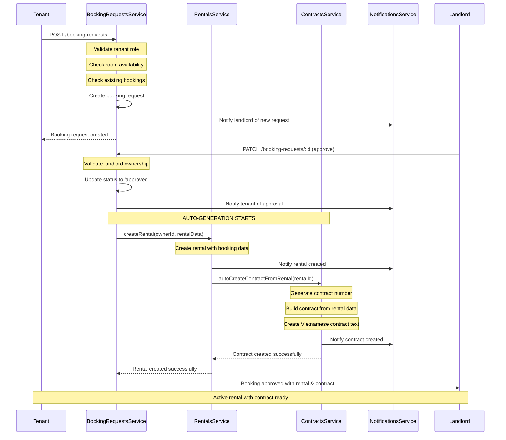
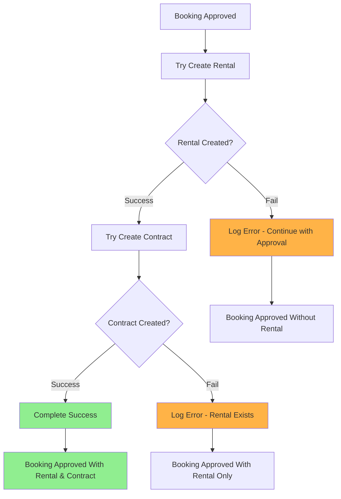

# Booking Request Flow

## Tenant Initiates Booking Request

```mermaid
sequenceDiagram
    participant T as Tenant
    participant BR as BookingRequestsService
    participant R as RentalsService
    participant C as ContractsService
    participant N as NotificationsService
    participant L as Landlord
    
    T->>BR: POST /booking-requests
    Note over BR: Validate tenant role
    Note over BR: Check room availability
    Note over BR: Check existing bookings
    BR->>BR: Create booking request
    BR->>N: Notify landlord of new request
    BR-->>T: Booking request created
    
    L->>BR: PATCH /booking-requests/:id (approve)
    Note over BR: Validate landlord ownership
    BR->>BR: Update status to 'approved'
    BR->>N: Notify tenant of approval
    
    Note over BR,C: AUTO-GENERATION STARTS
    BR->>R: createRental(ownerId, rentalData)
    Note over R: Create rental with booking data
    R->>N: Notify rental created
    R->>C: autoCreateContractFromRental(rentalId)
    Note over C: Generate contract number
    Note over C: Build contract from rental data
    Note over C: Create Vietnamese contract text
    C->>N: Notify contract created
    C-->>R: Contract created successfully
    R-->>BR: Rental created successfully
    BR-->>L: Booking approved with rental & contract
    
    Note over T,L: Active rental with contract ready
```

## Error Handling in Auto-Generation

```mermaid
flowchart TD
    A[Booking Approved] --> B[Try Create Rental]
    B --> C{Rental Created?}
    
    C -->|Success| D[Try Create Contract]
    C -->|Fail| E[Log Error - Continue with Approval]
    
    D --> F{Contract Created?}
    F -->|Success| G[Complete Success]
    F -->|Fail| H[Log Error - Rental Exists]
    
    E --> I[Booking Approved Without Rental]
    H --> J[Booking Approved With Rental Only]
    G --> K[Booking Approved With Rental & Contract]
    
    style G fill:#90EE90
    style K fill:#90EE90
    style E fill:#FFB347
    style H fill:#FFB347
```