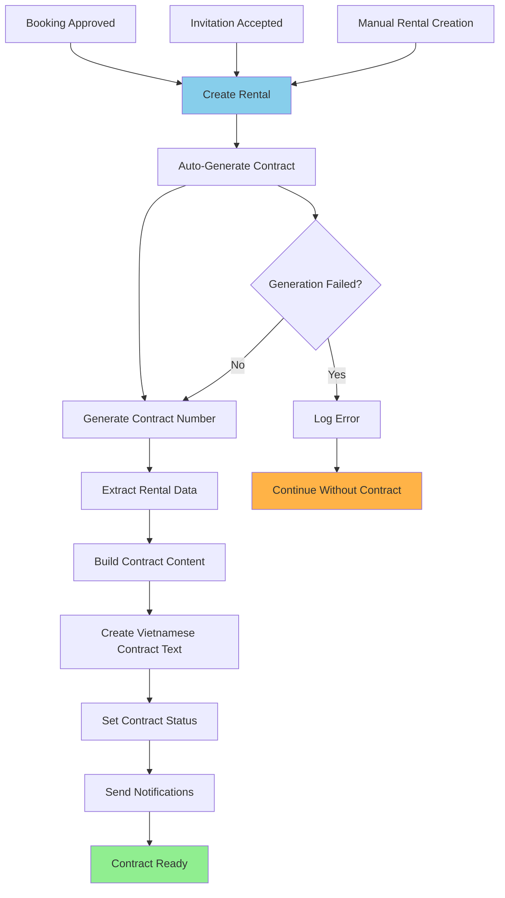
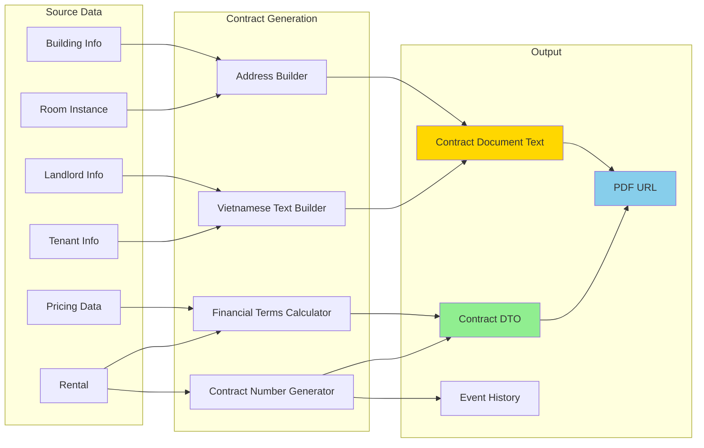
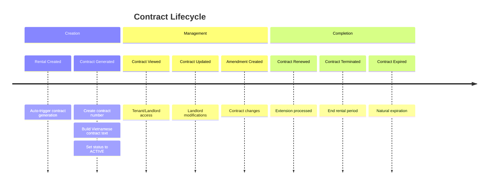
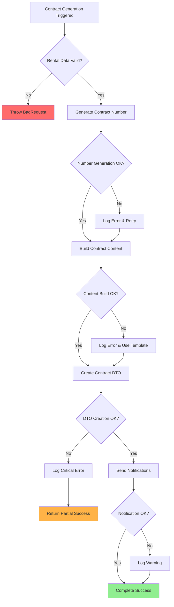

# Contract Auto-Generation Flow

## Contract Generation Architecture

```mermaid
flowchart TD
    A[Booking Approved] --> D[Create Rental]
    B[Invitation Accepted] --> D
    C[Manual Rental Creation] --> D
    
    D --> E[Auto-Generate Contract]
    E --> F[Generate Contract Number]
    F --> G[Extract Rental Data]
    G --> H[Build Contract Content]
    H --> I[Create Vietnamese Contract Text]
    I --> J[Set Contract Status]
    J --> K[Send Notifications]
    K --> L[Contract Ready]
    
    E --> M{Generation Failed?}
    M -->|Yes| N[Log Error]
    M -->|No| F
    
    N --> O[Continue Without Contract]
    
    style L fill:#90EE90
    style O fill:#FFB347
    style D fill:#87CEEB
```

## Contract Data Flow

```mermaid
flowchart LR
    subgraph "Source Data"
        A[Rental]
        B[Tenant Info]
        C[Landlord Info]
        D[Room Instance]
        E[Building Info]
        F[Pricing Data]
    end
    
    subgraph "Contract Generation"
        G[Contract Number Generator]
        H[Vietnamese Text Builder]
        I[Financial Terms Calculator]
        J[Address Builder]
    end
    
    subgraph "Output"
        K[Contract DTO]
        L[Contract Document Text]
        M[PDF URL]
        N[Event History]
    end
    
    A --> G
    A --> I
    B --> H
    C --> H
    D --> J
    E --> J
    F --> I
    
    G --> K
    H --> L
    I --> K
    J --> L
    
    K --> M
    L --> M
    G --> N
    
    style K fill:#90EE90
    style L fill:#FFD700
    style M fill:#87CEEB
```

## Contract Lifecycle Events

```mermaid
timeline
    title Contract Lifecycle
    
    section Creation
        Rental Created     : Auto-trigger contract generation
        Contract Generated : Create contract number
                            : Build Vietnamese contract text
                            : Set status to ACTIVE
        
    section Management
        Contract Viewed    : Tenant/Landlord access
        Contract Updated   : Landlord modifications
        Amendment Created  : Contract changes
        
    section Completion
        Contract Renewed   : Extension processed
        Contract Terminated : End rental period
        Contract Expired   : Natural expiration
```

## Error Handling Strategy

```mermaid
flowchart TD
    A[Contract Generation Triggered] --> B{Rental Data Valid?}
    
    B -->|No| C[Throw BadRequest]
    B -->|Yes| D[Generate Contract Number]
    
    D --> E{Number Generation OK?}
    E -->|No| F[Log Error & Retry]
    E -->|Yes| G[Build Contract Content]
    
    F --> G
    
    G --> H{Content Build OK?}
    H -->|No| I[Log Error & Use Template]
    H -->|Yes| J[Create Contract DTO]
    
    I --> J
    
    J --> K{DTO Creation OK?}
    K -->|No| L[Log Critical Error]
    K -->|Yes| M[Send Notifications]
    
    L --> N[Return Partial Success]
    
    M --> O{Notification OK?}
    O -->|No| P[Log Warning]
    O -->|Yes| Q[Complete Success]
    
    P --> Q
    
    style Q fill:#90EE90
    style N fill:#FFB347
    style C fill:#FF6B6B
```