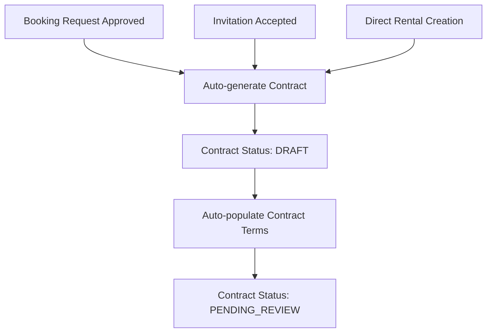
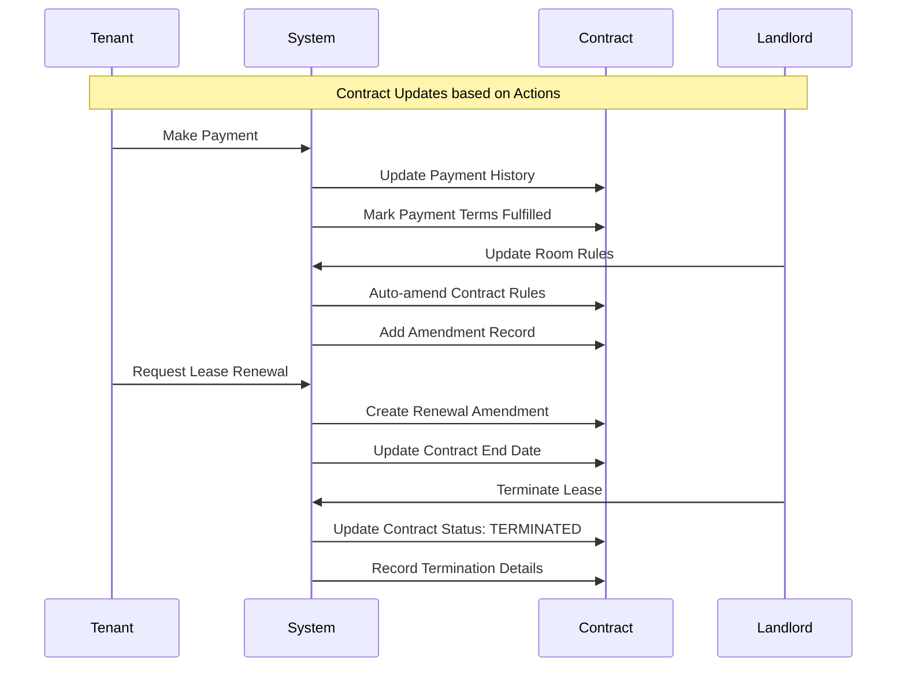
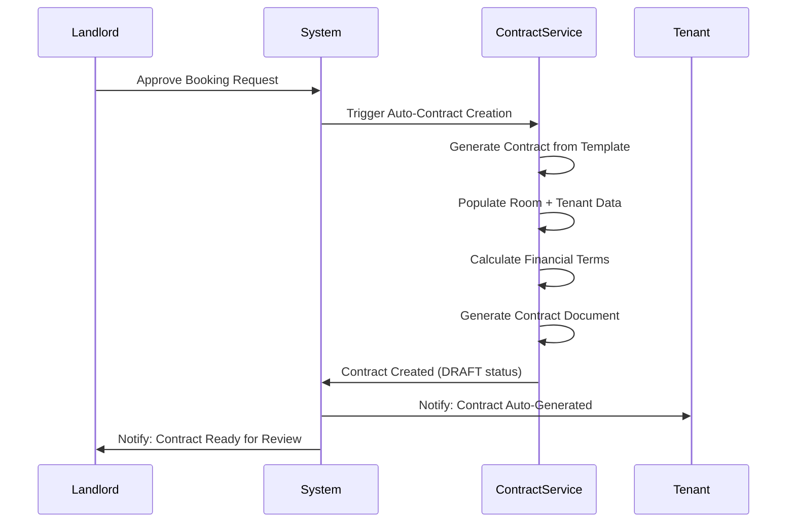
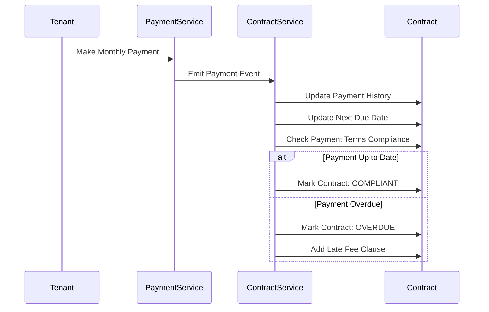
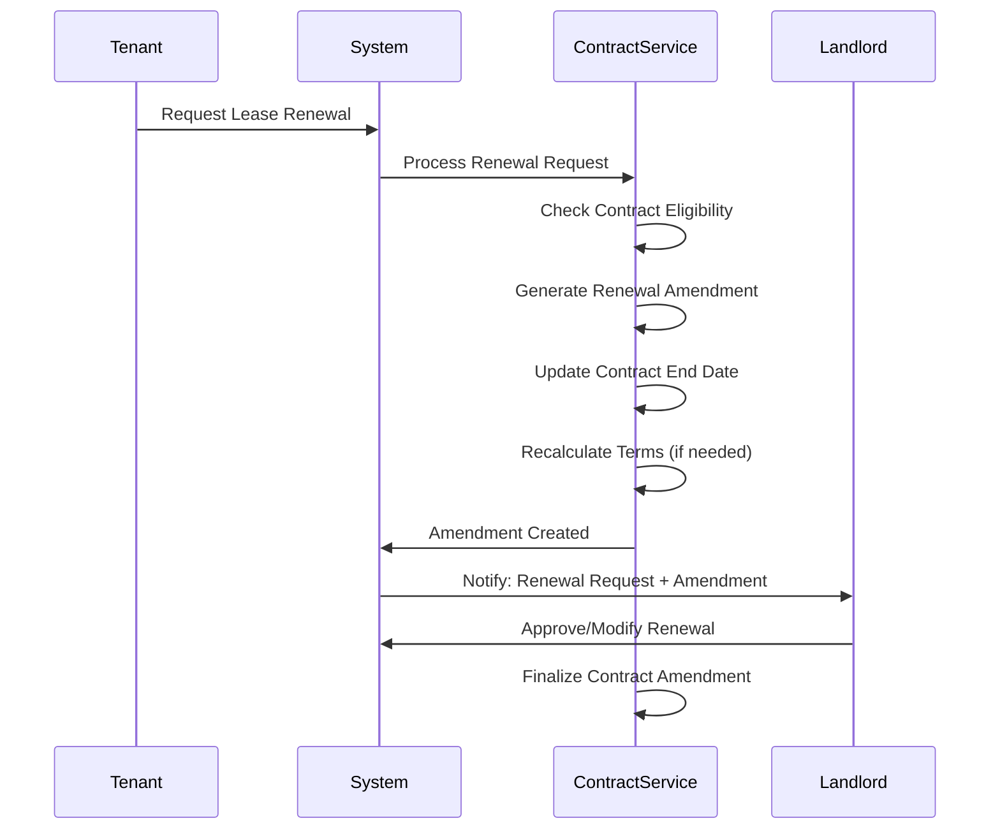

# 📋 Automatic Contract Management System

## 🎯 Concept: Hợp đồng tự động tạo và cập nhật

### **Core Principle**
Hợp đồng sẽ được **tự động tạo và cập nhật** dựa trên các action/event giữa tenant và landlord, không cần intervention thủ công.

## 🔄 **Contract Lifecycle Automation**

### **1. Contract Auto-Creation Triggers**



**Auto-populated fields:**
- Room details (name, address, specifications)
- Tenant information (name, contact, ID)
- Landlord information (name, contact, property ownership)
- Financial terms (rent, deposit, utilities)
- Lease duration (start date, end date)
- Property rules and amenities

### **2. Contract Auto-Updates**



## 🏗️ **Implementation Architecture**

### **Contract Service Layer**

```typescript
class AutoContractService {
  // Auto-create contract from approved booking/invitation
  async autoCreateContract(source: 'booking' | 'invitation', sourceId: string)
  
  // Auto-update contract based on rental events
  async autoUpdateContract(rentalId: string, event: ContractEvent)
  
  // Auto-generate contract document
  async generateContractDocument(contractId: string)
  
  // Auto-calculate contract terms
  async calculateContractTerms(roomId: string, tenantId: string)
}
```

### **Contract Templates**

```typescript
interface ContractTemplate {
  templateId: string
  name: string
  roomType: RoomType
  clauses: ContractClause[]
  variables: TemplateVariable[]
}

interface ContractClause {
  clauseId: string
  title: string
  content: string
  isMandatory: boolean
  variables: string[] // {{tenantName}}, {{monthlyRent}}
}
```

### **Auto-Update Events**

```typescript
enum ContractUpdateEvent {
  PAYMENT_MADE = 'payment_made',
  PAYMENT_OVERDUE = 'payment_overdue', 
  LEASE_RENEWAL_REQUESTED = 'lease_renewal_requested',
  LEASE_TERMINATED = 'lease_terminated',
  ROOM_RULES_UPDATED = 'room_rules_updated',
  RENT_INCREASED = 'rent_increased',
  DEPOSIT_ADJUSTMENT = 'deposit_adjustment',
  TENANT_VIOLATION = 'tenant_violation',
  MAINTENANCE_COMPLETED = 'maintenance_completed'
}
```

## 📄 **Contract Document Auto-Generation**

### **Template System**

```html
<!-- Contract Template Example -->
<div class="contract-header">
  <h1>HỢP ĐỒNG THUÊ PHÒNG TRỌ</h1>
  <p>Số hợp đồng: {{contractId}}</p>
  <p>Ngày tạo: {{createdDate}}</p>
</div>

<div class="parties">
  <h2>CÁC BÊN THAM GIA</h2>
  <p><strong>BÊN CHO THUÊ:</strong> {{landlordName}}</p>
  <p>CMND: {{landlordId}}</p>
  <p>Điện thoại: {{landlordPhone}}</p>
  
  <p><strong>BÊN THUÊ:</strong> {{tenantName}}</p>
  <p>CMND: {{tenantId}}</p>
  <p>Điện thoại: {{tenantPhone}}</p>
</div>

<div class="property-details">
  <h2>THÔNG TIN PHÒNG TRỌ</h2>
  <p>Tên phòng: {{roomName}}</p>
  <p>Địa chỉ: {{fullAddress}}</p>
  <p>Diện tích: {{roomArea}}m²</p>
  <p>Số phòng: {{roomNumber}}</p>
</div>

<div class="financial-terms">
  <h2>ĐIỀU KHOẢN TÀI CHÍNH</h2>
  <p>Tiền thuê hàng tháng: {{monthlyRent}} VND</p>
  <p>Tiền đặt cọc: {{depositAmount}} VND</p>
  <p>Tiền điện: {{electricityRate}} VND/kWh</p>
  <p>Tiền nước: {{waterRate}} VND/m³</p>
</div>

<div class="lease-terms">
  <h2>THỜI GIAN THUÊ</h2>
  <p>Ngày bắt đầu: {{startDate}}</p>
  <p>Ngày kết thúc: {{endDate}}</p>
  <p>Thời gian thuê: {{leaseDurationMonths}} tháng</p>
</div>
```

## 🔄 **Automation Workflow**

### **Flow 1: Booking Approval → Auto Contract**



### **Flow 2: Payment Made → Auto Update**



### **Flow 3: Lease Renewal → Auto Amendment**



## 📊 **Contract Status Automation**

```typescript
enum ContractStatus {
  DRAFT = 'draft',           // Auto-generated, pending review
  ACTIVE = 'active',         // Both parties agreed, lease started
  PENDING_RENEWAL = 'pending_renewal', // Renewal requested
  RENEWED = 'renewed',       // Successfully renewed
  TERMINATED = 'terminated', // Ended by either party
  EXPIRED = 'expired',       // Natural expiration
  BREACHED = 'breached',     // Terms violated
  SUSPENDED = 'suspended'    // Temporarily paused
}
```

**Status Auto-Transitions:**
- `DRAFT` → `ACTIVE` khi rental bắt đầu
- `ACTIVE` → `PENDING_RENEWAL` khi tenant request renewal
- `ACTIVE` → `TERMINATED` khi có termination
- `ACTIVE` → `EXPIRED` khi hết hạn tự nhiên
- `ACTIVE` → `BREACHED` khi vi phạm terms

## 🔧 **Implementation Plan**

1. **Contract Templates Database** - Lưu các template theo room type
2. **Auto-Generation Service** - Tạo contract từ booking/invitation data  
3. **Event Listeners** - Listen các rental events để update contract
4. **Document Generator** - Generate PDF từ contract data
5. **Amendment System** - Track contract changes over time
6. **Compliance Checker** - Monitor contract term compliance

Bạn có muốn implement system này không?