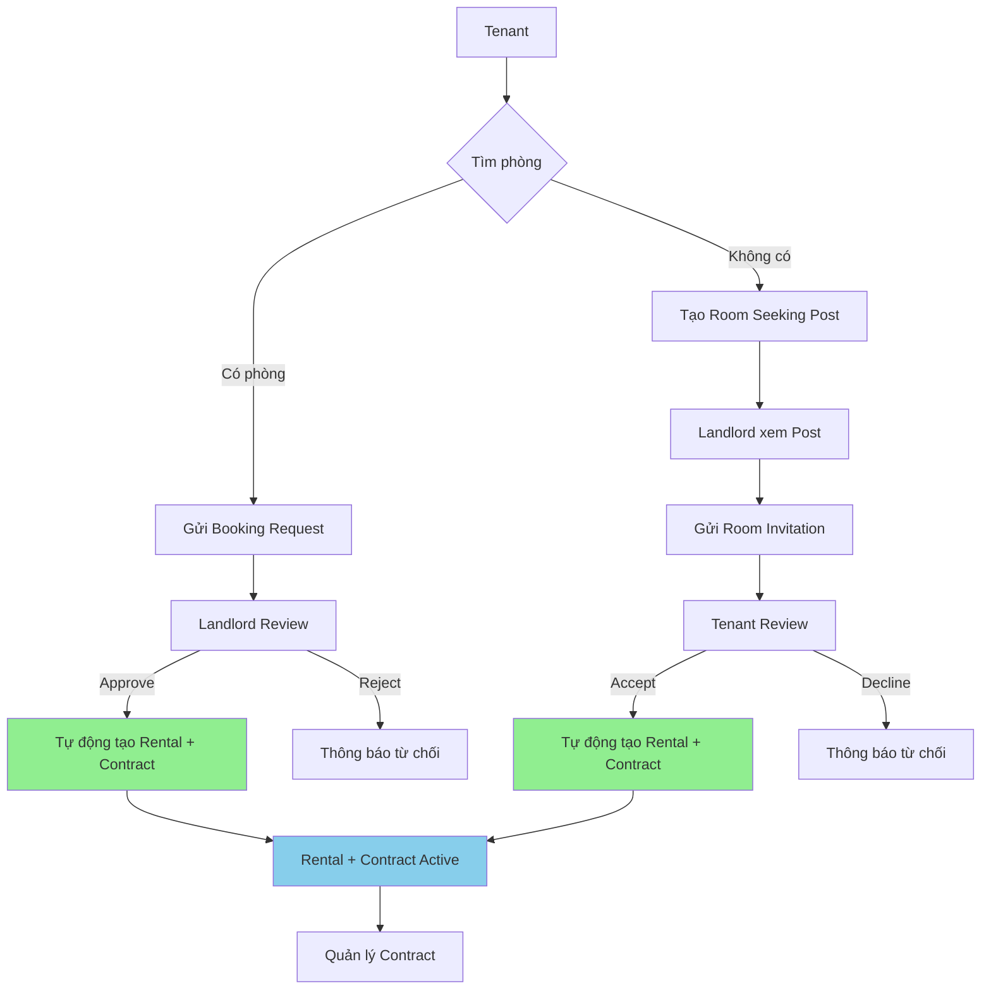
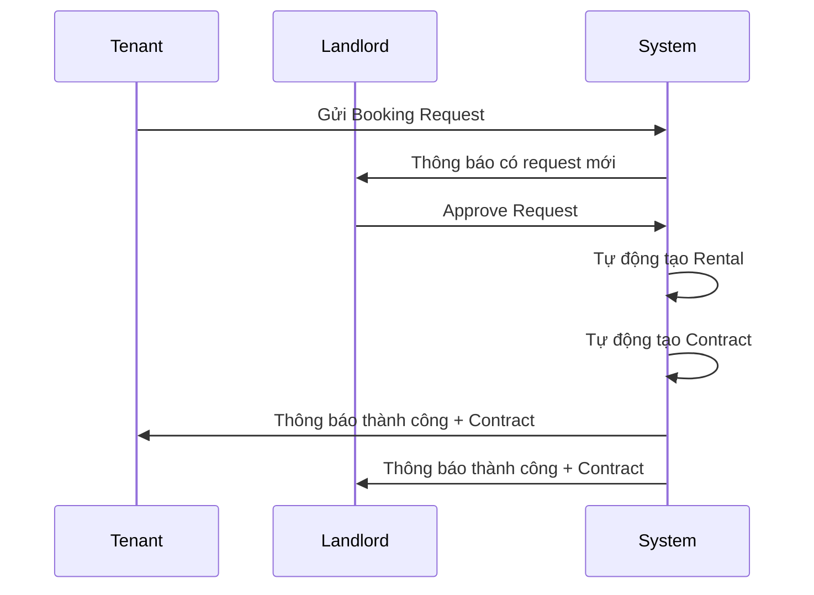
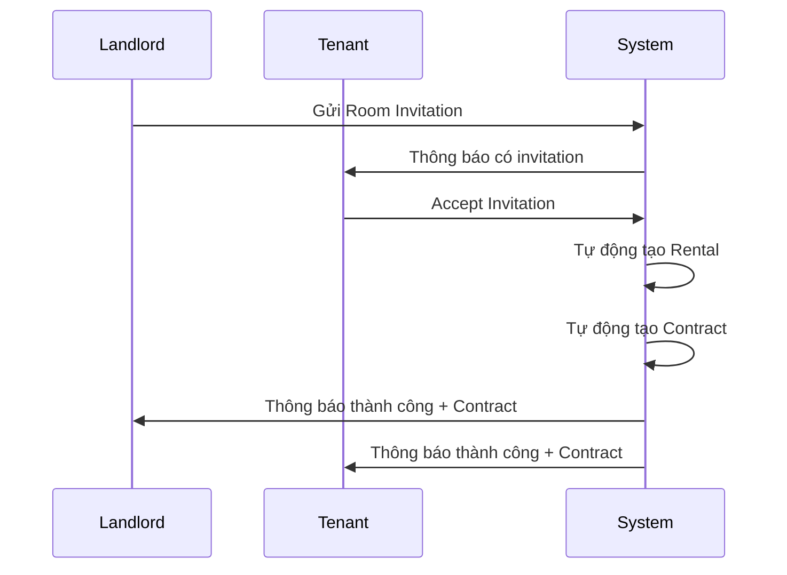
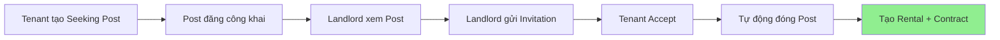
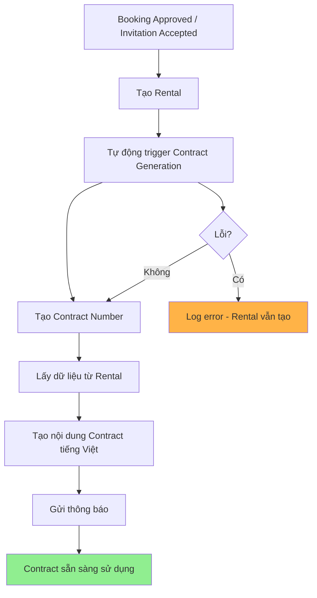

# Main Tenant-Landlord Interaction Flows

## 1. Complete System Flow với Auto Contract Generation

## 2. Booking Request Flow

## 3. Room Invitation Flow

## 4. Room Seeking Post Flow

## 5. Contract Auto-Generation Process

## 6. Key Integration Points

- **BookingRequestsService**: Line 307-332 - Auto-create rental + contract khi approve
- **RoomInvitationsService**: Line 375-395 - Auto-create rental + contract khi accept  
- **RentalsService**: Line 191-197 - Auto-create contract khi tạo rental
- **ContractsService**: autoCreateContractFromRental() - Core contract generation logic

## 7. Error Handling Strategy

- Tất cả auto-generation đều có try-catch
- Không làm fail main flow nếu contract generation lỗi
- Log errors để debug
- Graceful degradation: Rental vẫn tạo được ngay cả khi contract fail