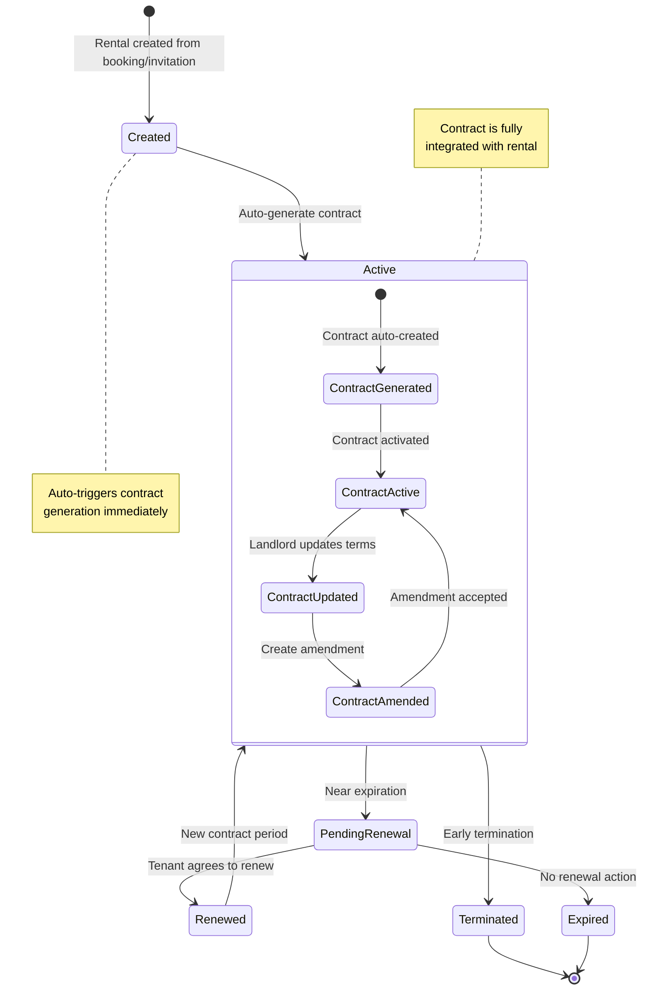
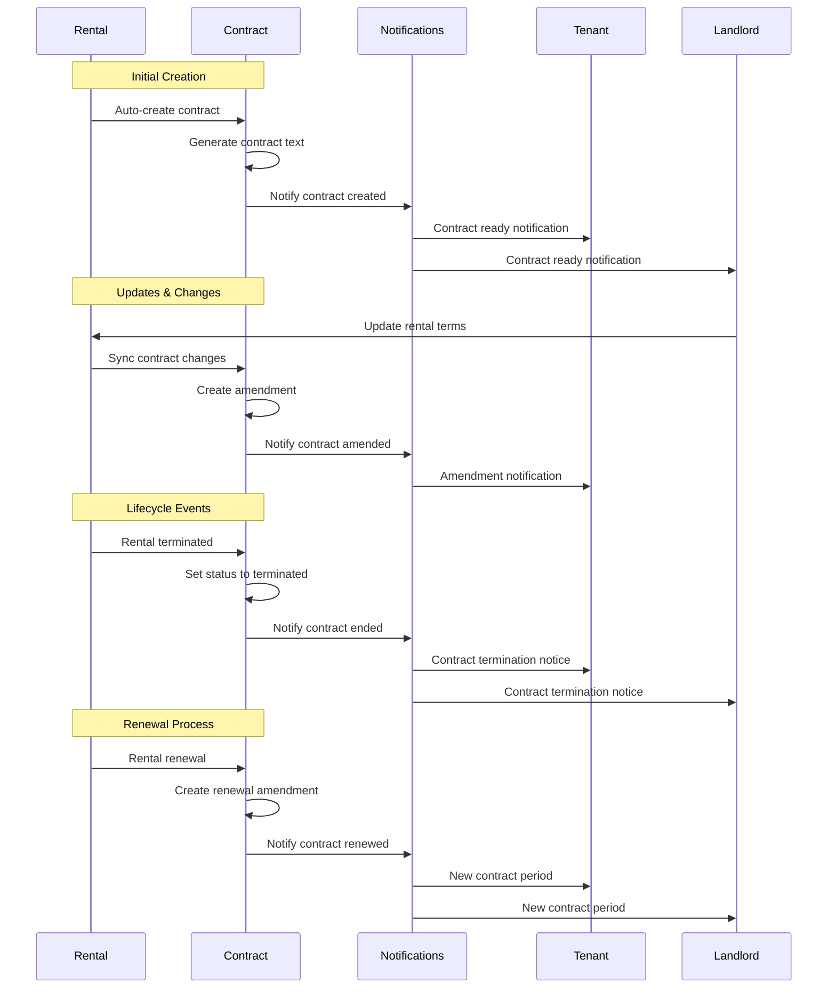
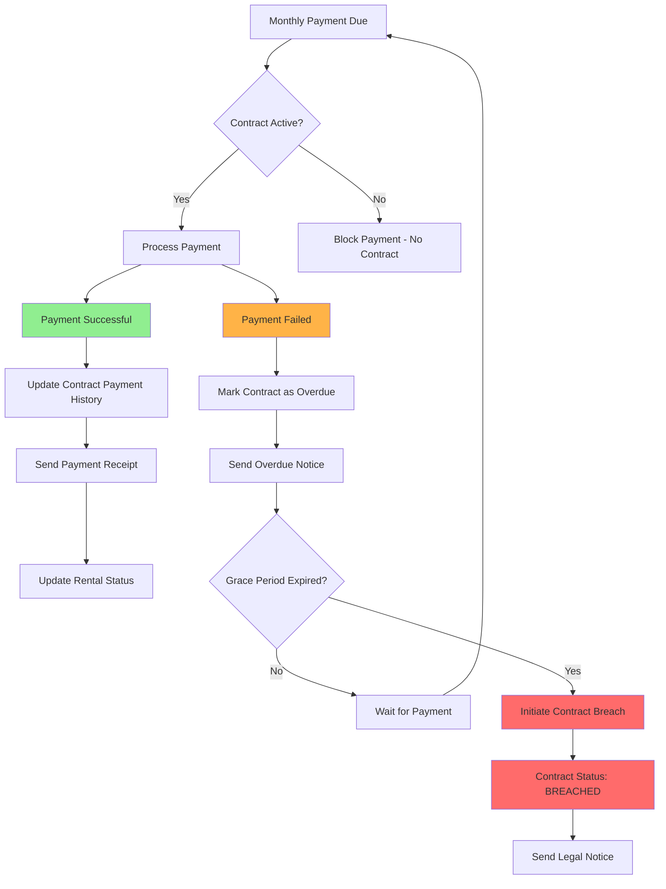
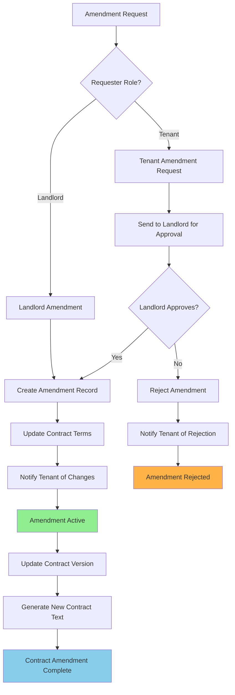

# Rental Lifecycle Flow

## Complete Rental Journey with Contract Integration

```mermaid
stateDiagram-v2
    [*] --> Created: Rental created from booking/invitation
    Created --> Active: Auto-generate contract
    
    state Active {
        [*] --> ContractGenerated: Contract auto-created
        ContractGenerated --> ContractActive: Contract activated
        ContractActive --> ContractUpdated: Landlord updates terms
        ContractUpdated --> ContractAmended: Create amendment
        ContractAmended --> ContractActive: Amendment accepted
    }
    
    Active --> PendingRenewal: Near expiration
    PendingRenewal --> Renewed: Tenant agrees to renew
    PendingRenewal --> Expired: No renewal action
    
    Active --> Terminated: Early termination
    Renewed --> Active: New contract period
    
    Terminated --> [*]
    Expired --> [*]
    
    note right of Created
        Auto-triggers contract
        generation immediately
    end note
    
    note left of Active
        Contract is fully
        integrated with rental
    end note
```

## Rental-Contract Synchronization

```mermaid
sequenceDiagram
    participant R as Rental
    participant C as Contract
    participant N as Notifications
    participant T as Tenant
    participant L as Landlord
    
    Note over R,C: Initial Creation
    R->>C: Auto-create contract
    C->>C: Generate contract text
    C->>N: Notify contract created
    N->>T: Contract ready notification
    N->>L: Contract ready notification
    
    Note over R,C: Updates & Changes
    L->>R: Update rental terms
    R->>C: Sync contract changes
    C->>C: Create amendment
    C->>N: Notify contract amended
    N->>T: Amendment notification
    
    Note over R,C: Lifecycle Events
    R->>C: Rental terminated
    C->>C: Set status to terminated
    C->>N: Notify contract ended
    N->>T: Contract termination notice
    N->>L: Contract termination notice
    
    Note over R,C: Renewal Process
    R->>C: Rental renewal
    C->>C: Create renewal amendment
    C->>N: Notify contract renewed
    N->>T: New contract period
    N->>L: New contract period
```

## Payment Integration with Contracts

```mermaid
flowchart TD
    A[Monthly Payment Due] --> B{Contract Active?}
    B -->|Yes| C[Process Payment]
    B -->|No| D[Block Payment - No Contract]
    
    C --> E[Payment Successful]
    E --> F[Update Contract Payment History]
    F --> G[Send Payment Receipt]
    G --> H[Update Rental Status]
    
    C --> I[Payment Failed]
    I --> J[Mark Contract as Overdue]
    J --> K[Send Overdue Notice]
    K --> L{Grace Period Expired?}
    
    L -->|No| M[Wait for Payment]
    L -->|Yes| N[Initiate Contract Breach]
    
    M --> A
    N --> O[Contract Status: BREACHED]
    O --> P[Send Legal Notice]
    
    style E fill:#90EE90
    style I fill:#FFB347
    style N fill:#FF6B6B
    style O fill:#FF6B6B
```

## Contract Amendment Process

```mermaid
flowchart TD
    A[Amendment Request] --> B{Requester Role?}
    
    B -->|Landlord| C[Landlord Amendment]
    B -->|Tenant| D[Tenant Amendment Request]
    
    C --> E[Create Amendment Record]
    E --> F[Update Contract Terms]
    F --> G[Notify Tenant of Changes]
    G --> H[Amendment Active]
    
    D --> I[Send to Landlord for Approval]
    I --> J{Landlord Approves?}
    
    J -->|Yes| E
    J -->|No| K[Reject Amendment]
    
    K --> L[Notify Tenant of Rejection]
    L --> M[Amendment Rejected]
    
    H --> N[Update Contract Version]
    N --> O[Generate New Contract Text]
    O --> P[Contract Amendment Complete]
    
    style H fill:#90EE90
    style M fill:#FFB347
    style P fill:#87CEEB
```