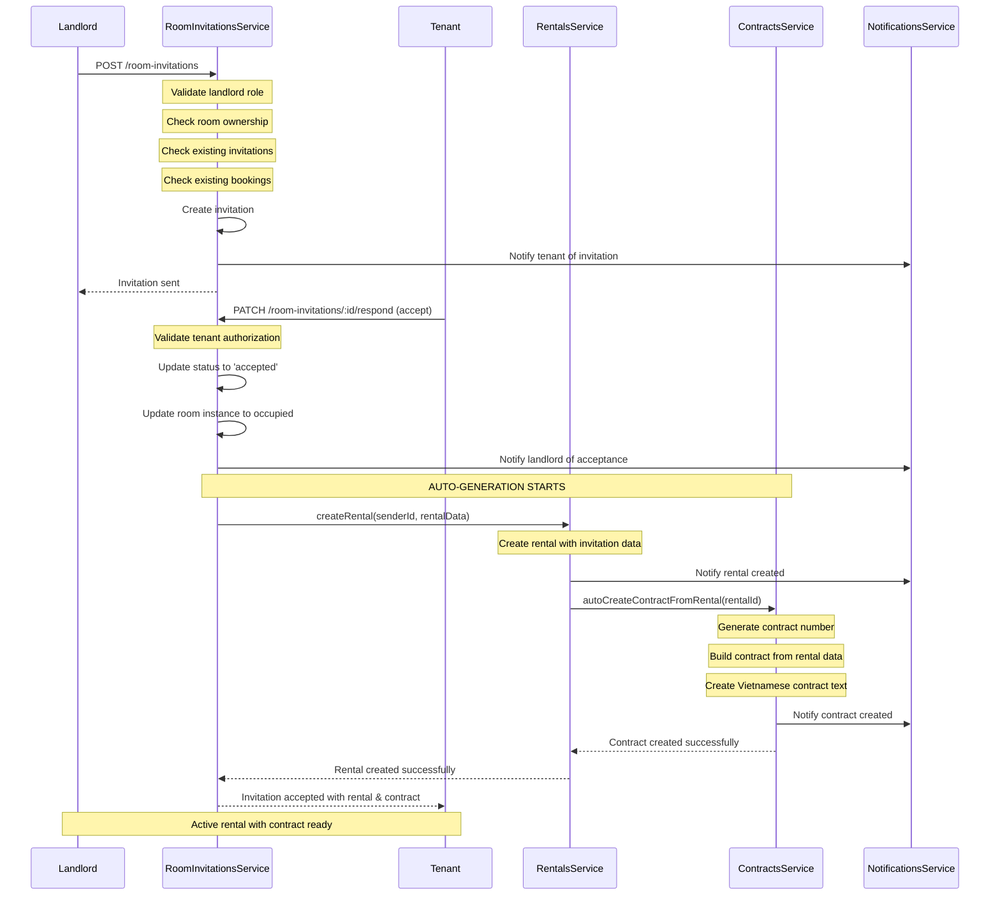
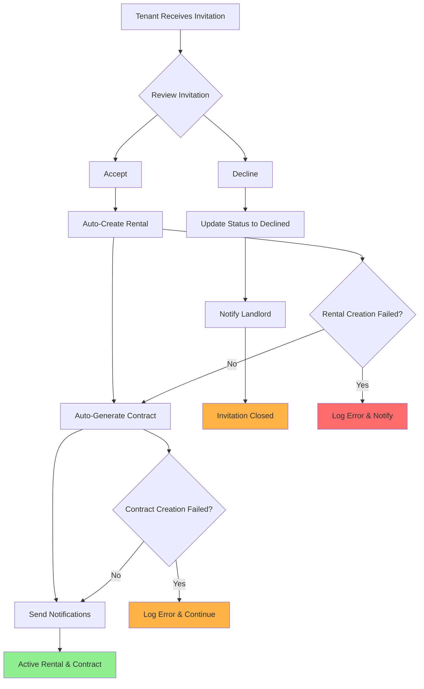

# Room Invitation Flow

## Landlord Invites Tenant

```mermaid
sequenceDiagram
    participant L as Landlord
    participant RI as RoomInvitationsService
    participant T as Tenant
    participant R as RentalsService
    participant C as ContractsService
    participant N as NotificationsService
    
    L->>RI: POST /room-invitations
    Note over RI: Validate landlord role
    Note over RI: Check room ownership
    Note over RI: Check existing invitations
    Note over RI: Check existing bookings
    RI->>RI: Create invitation
    RI->>N: Notify tenant of invitation
    RI-->>L: Invitation sent
    
    T->>RI: PATCH /room-invitations/:id/respond (accept)
    Note over RI: Validate tenant authorization
    RI->>RI: Update status to 'accepted'
    RI->>RI: Update room instance to occupied
    RI->>N: Notify landlord of acceptance
    
    Note over RI,C: AUTO-GENERATION STARTS
    RI->>R: createRental(senderId, rentalData)
    Note over R: Create rental with invitation data
    R->>N: Notify rental created
    R->>C: autoCreateContractFromRental(rentalId)
    Note over C: Generate contract number
    Note over C: Build contract from rental data
    Note over C: Create Vietnamese contract text
    C->>N: Notify contract created
    C-->>R: Contract created successfully
    R-->>RI: Rental created successfully
    RI-->>T: Invitation accepted with rental & contract
    
    Note over L,T: Active rental with contract ready
```

## Invitation Decision Flow

```mermaid
flowchart TD
    A[Tenant Receives Invitation] --> B{Review Invitation}
    B --> C[Accept]
    B --> D[Decline]
    
    C --> E[Auto-Create Rental]
    E --> F[Auto-Generate Contract]
    F --> G[Send Notifications]
    G --> H[Active Rental & Contract]
    
    D --> I[Update Status to Declined]
    I --> J[Notify Landlord]
    J --> K[Invitation Closed]
    
    E --> L{Rental Creation Failed?}
    L -->|Yes| M[Log Error & Notify]
    L -->|No| F
    
    F --> N{Contract Creation Failed?}
    N -->|Yes| O[Log Error & Continue]
    N -->|No| G
    
    style H fill:#90EE90
    style K fill:#FFB347
    style M fill:#FF6B6B
    style O fill:#FFB347
```