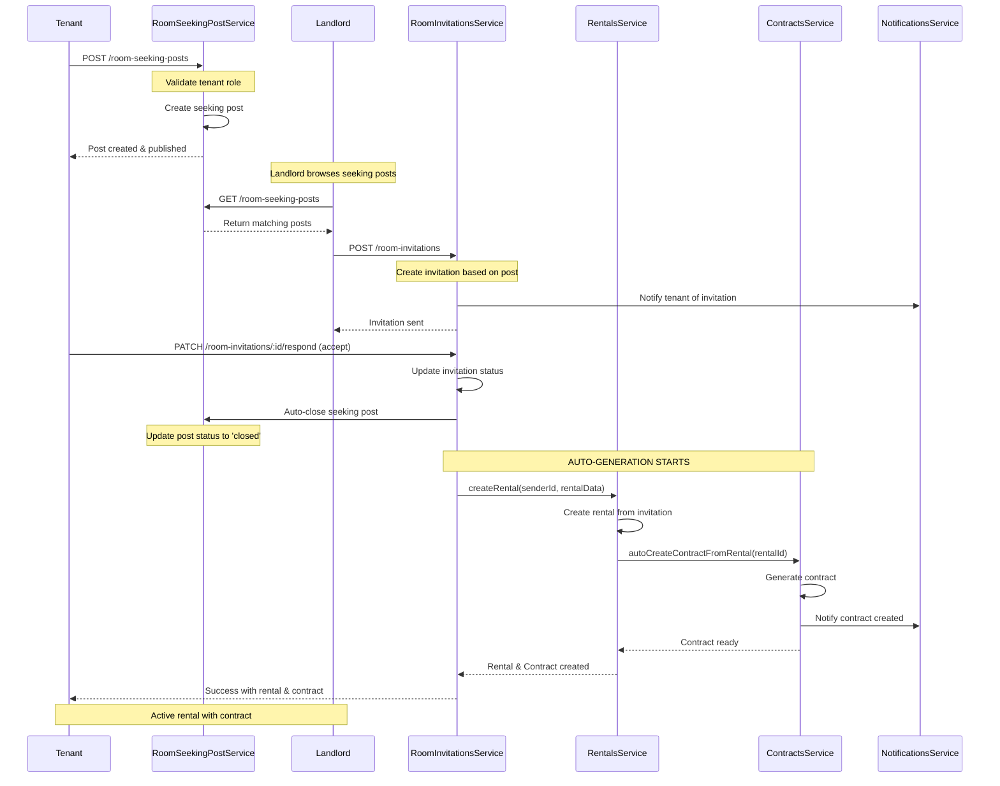
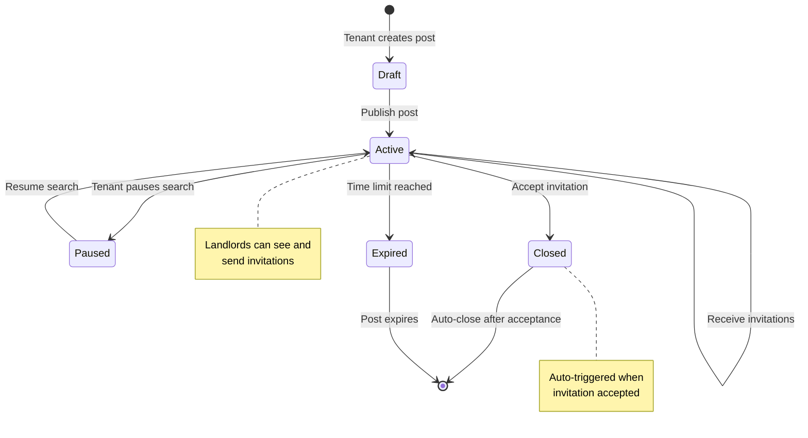
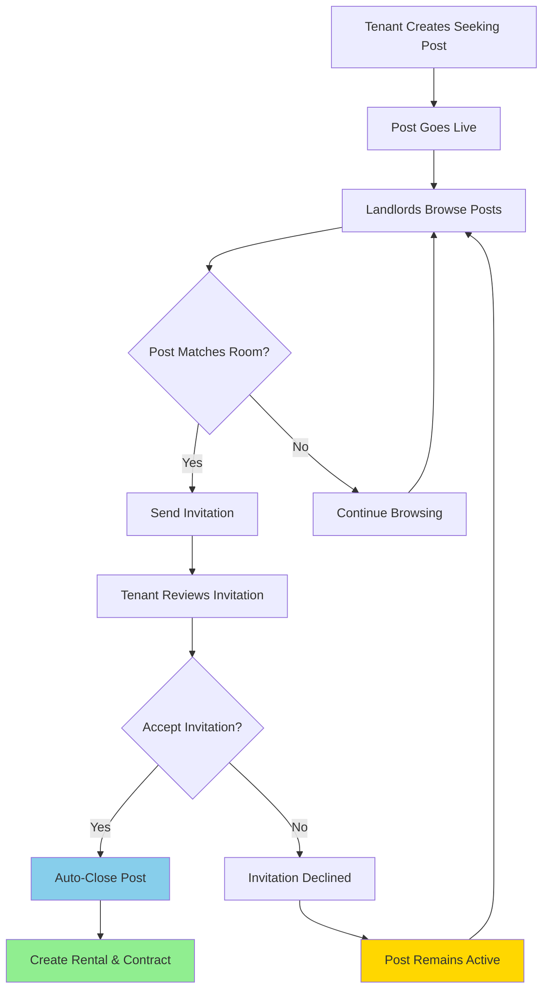

# Room Seeking Post Flow

## Tenant Creates Room Seeking Post

```mermaid
sequenceDiagram
    participant T as Tenant
    participant RSP as RoomSeekingPostService
    participant L as Landlord
    participant RI as RoomInvitationsService
    participant R as RentalsService
    participant C as ContractsService
    participant N as NotificationsService
    
    T->>RSP: POST /room-seeking-posts
    Note over RSP: Validate tenant role
    RSP->>RSP: Create seeking post
    RSP-->>T: Post created & published
    
    Note over L: Landlord browses seeking posts
    L->>RSP: GET /room-seeking-posts
    RSP-->>L: Return matching posts
    
    L->>RI: POST /room-invitations
    Note over RI: Create invitation based on post
    RI->>N: Notify tenant of invitation
    RI-->>L: Invitation sent
    
    T->>RI: PATCH /room-invitations/:id/respond (accept)
    RI->>RI: Update invitation status
    RI->>RSP: Auto-close seeking post
    Note over RSP: Update post status to 'closed'
    
    Note over RI,C: AUTO-GENERATION STARTS
    RI->>R: createRental(senderId, rentalData)
    R->>R: Create rental from invitation
    R->>C: autoCreateContractFromRental(rentalId)
    C->>C: Generate contract
    C->>N: Notify contract created
    C-->>R: Contract ready
    R-->>RI: Rental & Contract created
    RI-->>T: Success with rental & contract
    
    Note over T,L: Active rental with contract
```

## Room Seeking Post Lifecycle

```mermaid
stateDiagram-v2
    [*] --> Draft: Tenant creates post
    Draft --> Active: Publish post
    Active --> Active: Receive invitations
    Active --> Paused: Tenant pauses search
    Paused --> Active: Resume search
    Active --> Closed: Accept invitation
    Active --> Expired: Time limit reached
    Closed --> [*]: Auto-close after acceptance
    Expired --> [*]: Post expires
    
    note right of Active
        Landlords can see and
        send invitations
    end note
    
    note right of Closed
        Auto-triggered when
        invitation accepted
    end note
```

## Post Matching and Discovery

```mermaid
flowchart TD
    A[Tenant Creates Seeking Post] --> B[Post Goes Live]
    B --> C[Landlords Browse Posts]
    
    C --> D{Post Matches Room?}
    D -->|Yes| E[Send Invitation]
    D -->|No| F[Continue Browsing]
    
    E --> G[Tenant Reviews Invitation]
    G --> H{Accept Invitation?}
    
    H -->|Yes| I[Auto-Close Post]
    H -->|No| J[Invitation Declined]
    
    I --> K[Create Rental & Contract]
    J --> L[Post Remains Active]
    L --> C
    
    F --> C
    
    style K fill:#90EE90
    style I fill:#87CEEB
    style L fill:#FFD700
```