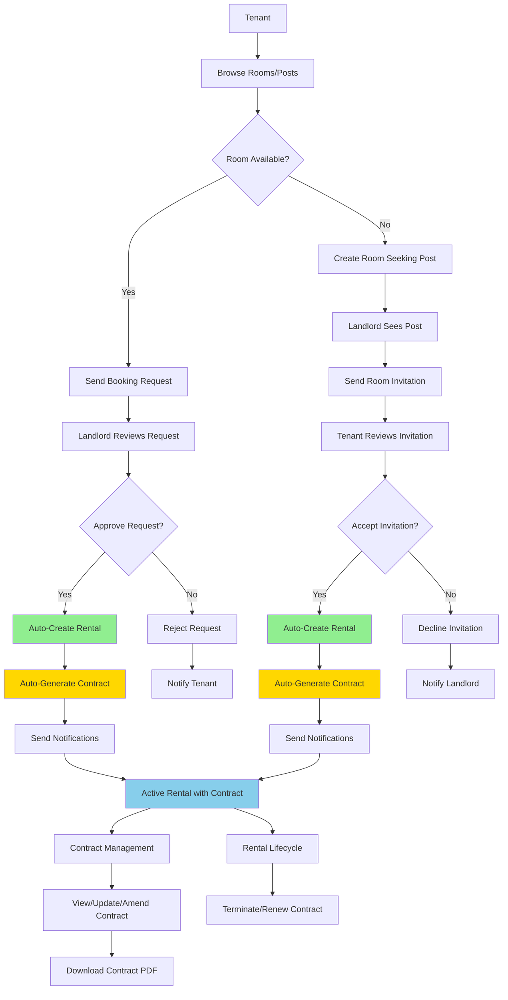

# Tenant-Landlord Interaction Flow

## Complete Flow with Automatic Contract Generation

## Key Features
- **Auto-Creation**: Rental and Contract are created automatically when booking is approved or invitation is accepted
- **Notification System**: All parties are notified at each step
- **Contract Management**: Full contract lifecycle with PDF generation
- **Error Handling**: Graceful fallback if auto-generation fails